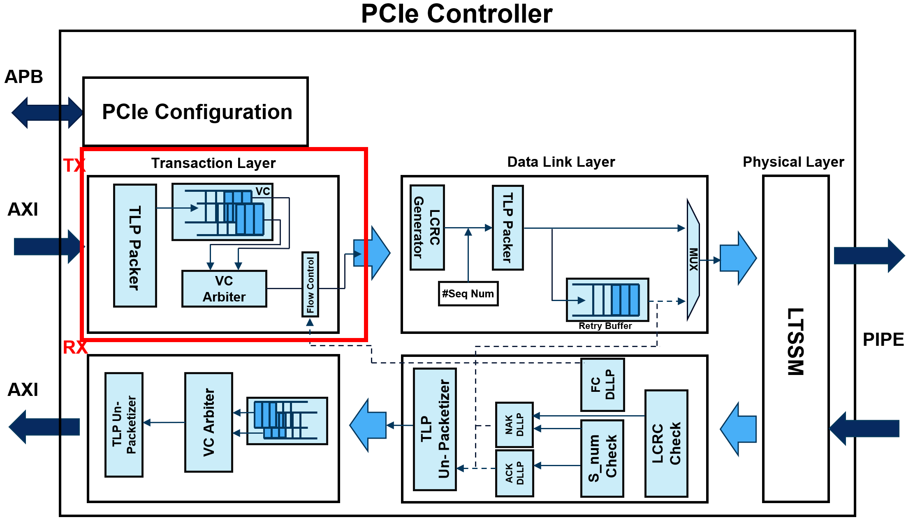

# PCIe Transaction Layer (TX)

The `PCIE_TL_TX` module is designed to handle the transmission of Transaction Layer Packets (TLPs) in a PCI Express (PCIe) interface. It integrates with an AXI interface for software communication and includes flow control mechanisms to manage TLP transmission efficiently. This document provides a detailed explanation of the module's components and operation.

## Module Interface

### Clock and Reset Signals

- `clk`: The clock signal.
- `rst_n`: Active-low reset signal.

### Flow Control Input

- `fc_valid_i`: Indicates whether flow control is valid.

### AXI Interface Signals

- `aw_ch`: AXI write address channel (slave).
- `w_ch`: AXI write data channel (slave).
- `b_ch`: AXI write response channel (slave).

### TLP Header Input

- `tlp_hdr_arr_i`: Input TLP header array.

### Data Link Layer Interface

- `tlp_valid_o`: Indicates if the TLP data output is valid.
- `tlp_o`: TLP data output.
- `tlp_ready_i`: Indicates if the TLP receiver is ready to accept data.

## Internal Signals

- `tlp_data`, `tlp_data_n`: Stores the current and next state of TLP data.
- `tlp_header`, `tlp_header_n`: Stores the current and next state of the TLP header.
- `tlp`, `tlp_n`: Stores the current and next state of the complete TLP packet.
- `tlp_valid`, `tlp_valid_n`: Indicates if the current and next TLP packet is valid.

### VC FIFO Signals

- `vc0_fifo_full`, `vc0_fifo_empty`: Indicates if the VC0 FIFO is full or empty.
- `vc1_fifo_full`, `vc1_fifo_empty`: Indicates if the VC1 FIFO is full or empty.
- `vc0_fifo_wren`, `vc0_fifo_rden`: Write and read enable signals for VC0 FIFO.
- `vc1_fifo_wren`, `vc1_fifo_rden`: Write and read enable signals for VC1 FIFO.
- `vc0_fifo_rdata`, `vc1_fifo_rdata`: Read data from VC0 and VC1 FIFOs.
- `vc0_fifo_wdata`, `vc1_fifo_wdata`: Write data to VC0 and VC1 FIFOs.

## Sequential Logic for State and TLP Data Update

The sequential logic block updates the states of `tlp_data`, `tlp_header`, `tlp`, and `tlp_valid` on the rising edge of the clock or when the reset is active. If reset is not active, it assigns the next state values to the current state variables. The current TLP header and TLP data are also displayed for debugging purposes.

## Combinational Logic for TLP Packing and FIFO Write Enable

The combinational logic block determines how the TLP packet is formed and manages the write enable signals for the VC FIFOs:

1. Default values are set for the next state variables and FIFO write enable signals.
2. The `awready` and `wready` signals are set to indicate that the module is ready to accept new write address and data.
3. If valid write address, data, and flow control signals are received, the following steps occur:
   - The TLP header is created from the input header array.
   - The TLP data is either set to zeros (for read requests) or taken from the AXI write data channel (for write requests).
   - The header and data are combined into a single TLP packet.
   - The TLP is marked as valid.
   - The TLP is written to the appropriate FIFO based on the traffic class (TC) value.

## Instantiation of VC FIFOs and Arbiter

The module instantiates two VC FIFOs and a PCIe arbiter:

- **VC0 FIFO**: Stores TLPs with a certain traffic class.
- **VC1 FIFO**: Stores TLPs with a different traffic class.
- **PCIe Arbiter**: Manages the TLP output by selecting TLPs from the appropriate FIFO based on availability and readiness signals.

## Summary

The `PCIE_TL_TX` module effectively manages the formation and transmission of TLPs in a PCIe interface. It handles TLP header and data combination, manages flow control, and ensures TLPs are correctly routed through virtual channels using FIFOs and an arbiter. The module includes debug statements to display the TLP header and generated TLPs for verification.
