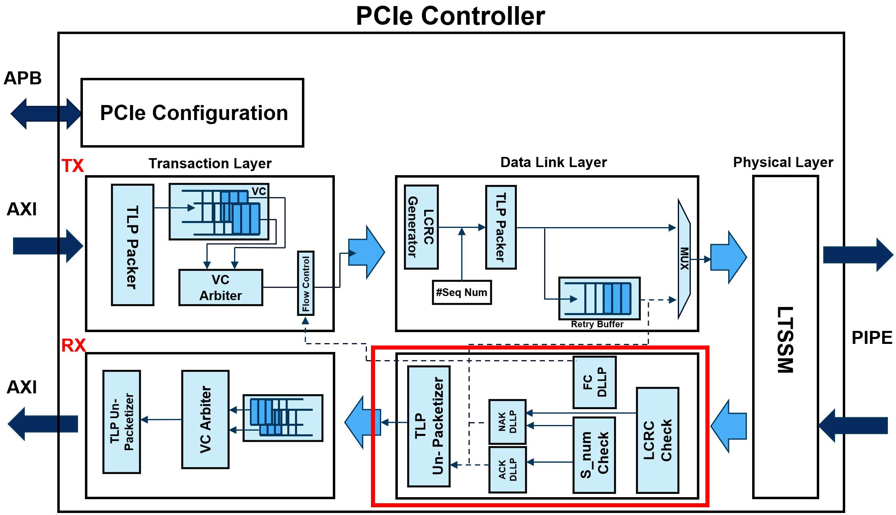

# PCIE_DLL_RX Module Operation Description

## Overview

The `PCIE_DLL_RX` module operates in the Data Link Layer of PCI Express, performing functions such as receiving data, CRC checking, flow control management, forwarding data to the Transaction Layer, and generating Ack/Nak DLLPs. This document describes the primary functions and internal operations of the module.

## Port Description

### Input Ports

- `clk`: Clock signal
- `rst_n`: Asynchronous reset signal (Active Low)
- `tlp_valid_i`: Indicates the validity of the TLP received from the Physical Layer
- `tlp_i`: TLP data input from the Physical Layer (including Sequence and CRC)
- `tlp_ready_i`: Indicates readiness to receive TLP from the Transaction Layer

### Output Ports

- `tlp_ready_o`: Indicates readiness to receive TLP from the Physical Layer
- `tlp_valid_o`: Indicates the validity of the TLP being sent to the Transaction Layer
- `tlp_o`: TLP data output to the Transaction Layer
- `dllp_o`: Ack/Nak DLLP output
- `dllp_fc_o`: Flow Control DLLP output

## Internal Logic Description

### CRC32 Check

A CRC32 checker instance is used to verify the CRC of the TLP data. The data portion of the TLP is checked against its CRC value. If the CRC is valid, the data is considered correctly received.

### TLP Handling Logic

The module checks the validity of the received TLP. If valid, it forwards the TLP data to the Transaction Layer and generates an Ack DLLP. If a CRC error is detected, a Nak DLLP is generated instead. Additionally, it checks the sequence number to ensure the TLPs are received in order.

### Flow Control Logic

The flow control logic manages write and read pointers to a buffer. It generates Flow Control DLLPs based on the buffer's state:

- **Write Pointer Update**: Increments the write pointer if a valid TLP is received and the module is ready to accept it.
- **Read Pointer Update**: Increments the read pointer if the TLP is valid and the Transaction Layer is ready to receive it.
- **Flag Updates**: Updates flags indicating whether the buffer is empty or full based on the state of the write and read pointers.
- **DLLP Flow Control Packet Generation**: Generates a Flow Control DLLP indicating the available space in the buffer. If the buffer is full, the data field in the DLLP is set to zero.

### Key Logic Explanation

- **Write Pointer Update**: Increases the write pointer when a valid TLP is accepted by the module.
- **Read Pointer Update**: Increases the read pointer when the Transaction Layer accepts a valid TLP.
- **Flag Updates**: Determines if the buffer is empty or full by comparing the write and read pointers.
- **DLLP Flow Control Packet Generation**: Creates a Flow Control DLLP based on the difference between the write and read pointers, indicating the buffer occupancy status.

This module ensures that the Data Link Layer of PCI Express correctly handles TLP reception, CRC validation, flow control, and communication with both the Physical and Transaction Layers. Additionally, it ensures that TLPs are received in the correct order by checking the sequence numbers.
