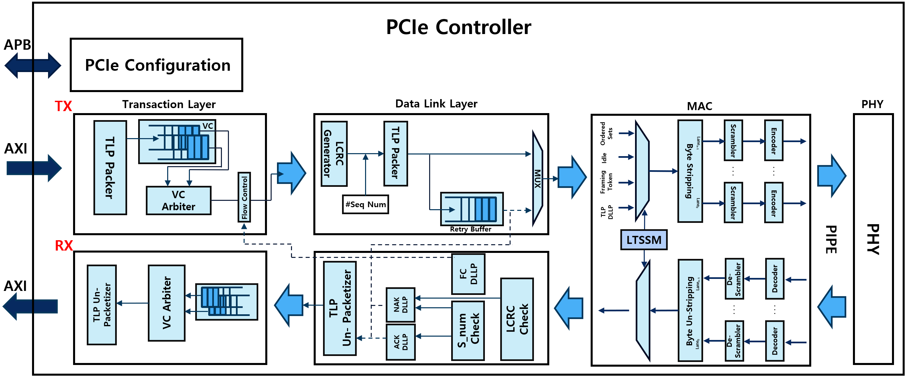
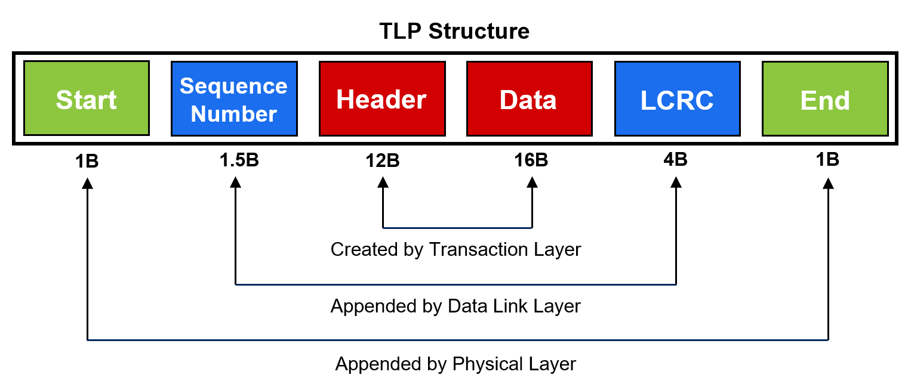
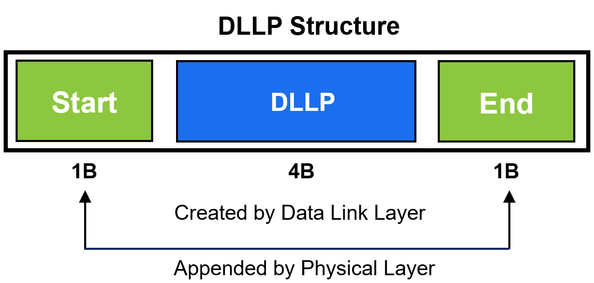
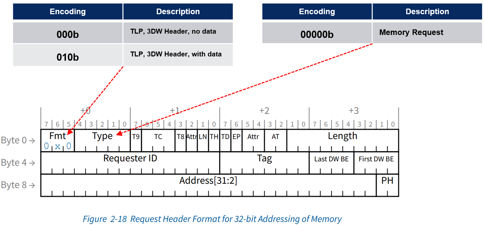
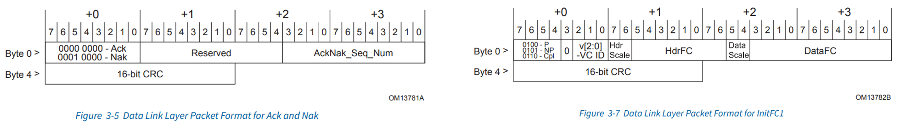
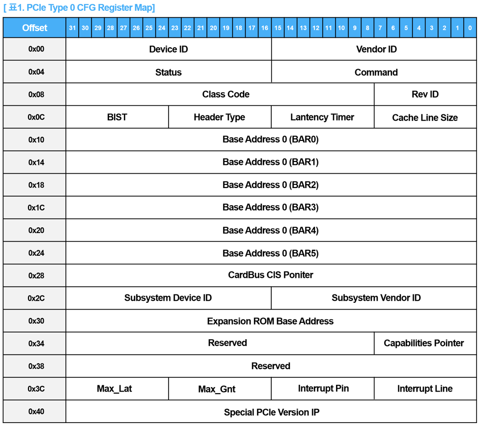
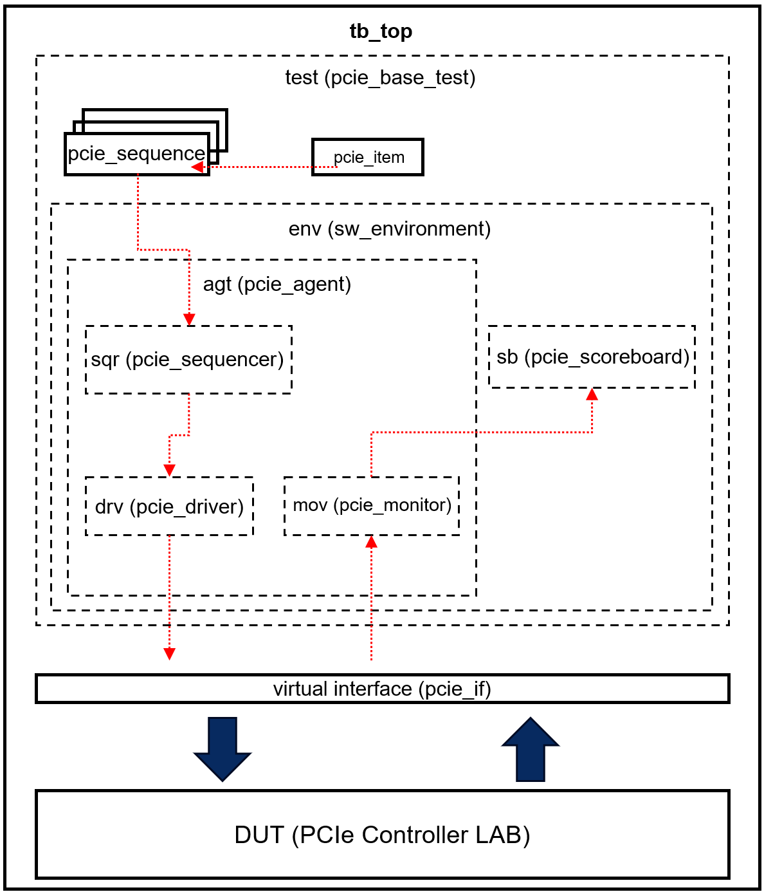

# Simple PCIe Controller with UVM

## Author

- **Junseung Lee**
- Department of Electrical and Computer Engineering, Sungkyunkwan University
- junseung0728@naver.com

In this project, the implemented PCIe controller can be broadly divided into the transmitter (Tx) and the receiver (Rx). Both the transmitter and receiver are composed of the transaction layer, data link layer, and physical layer.

In the transmitter (Tx), a series of tasks are performed to send packets to the receiver (Rx). In the transaction layer, the TLP header and TLP data are packed and placed into one of the two FIFOs implemented as VCs. Then, through flow control, if there are enough credits in the receiver, the TLP is sent to the data link layer. In the data link layer, a sequence number and LCRC are generated and added to the front and back of the TLP. Additionally, to prepare for transmission errors, a copy of the generated TLP is stored in the retry buffer before the packet is sent to the physical layer. The TLP stored in the retry buffer is either removed or retransmitted depending on whether an ACK or NAK is received. In the physical layer, framing symbols are added to the front and back of the received TLP, and the final packet is sent to the receiver (Rx) through the PCIe link. During this process, the link state is controlled by the LTSSM state machine.

Conversely, in the receiver (Rx), a series of processes are carried out to unpack the received packet and check for packet errors through CRC verification.

> **Note:** For convenience and to achieve the learning objectives, some logic does not fully adhere to PCIe specifications.(한국어 설명은 밑에 있습니다.)

---

## TLP Structure

ECRC is optional, so it was not included. While the data payload size can range from 0 to 4096 bytes, in this project it is fixed at 16 bytes.

  

---

## DLLP Structure

Although a 16-bit CRC is required in DLLP, it was not included to achieve the learning objectives (since LCRC has already been implemented in the transaction layer) and for convenience.

  

---

## Supported TLP Request Types

For convenience, only 32-bit addresses and memory requests are supported.

---

## Supported DLLP Request Types

These are DLLPs related to the ACK/NAK protocol and flow control.

---

## PCIe Configuration

The following table is the register map corresponding to the PCIe Type 0 header. The Special PCIe Version IP is not included in the PCIe specification (it is a register added for the project).

  

---

## Testbench

  

## 한국어 버전

### 개요

본 프로젝트에서 구현된 PCIe 컨트롤러는 크게 송신단(Tx)과 수신단(Rx)으로 나눌 수 있습니다. 송신단과 수신단은 각각 트랜잭션 레이어, 데이터 링크 레이어, 피지컬 레이어로 구성되어 있습니다.

송신단(Tx)에서는 수신단(Rx)으로 패킷을 보내기 위한 일련의 작업들이 수행됩니다. 트랜잭션 레이어에서는 TLP 헤더와 TLP 데이터를 패킹하고, 두 개의 FIFO로 구현된 VC 중 하나로 들어갑니다. 이후, 흐름 제어를 통해 수신단의 크레딧이 충분하면 TLP를 데이터 링크 레이어로 전송합니다. 데이터 링크 레이어에서는 시퀀스 번호와 LCRC를 생성하여 TLP의 앞뒤에 추가합니다. 또한 송신 오류에 대비하기 위해 생성된 TLP의 복사본을 재시도 버퍼에 저장한 뒤, 피지컬 레이어로 패킷을 전송합니다. 재시도 버퍼에 저장된 TLP는 ACK 또는 NAK에 따라 제거되거나 재전송됩니다. 피지컬 레이어에서는 입력받은 TLP의 앞뒤에 프레이밍 심볼을 추가하고, 최종 패킷을 PCIe 링크를 통해 수신단(Rx)으로 전송합니다. 이 과정에서 링크 상태는 LTSSM 상태 머신에 의해 제어됩니다.

반대로 수신단(Rx)에서는 전송받은 패킷을 언패킹하고, CRC 검사를 통해 패킷 오류 유무를 확인하는 일련의 과정을 거칩니다.

> **참고:** 구현의 편의성과 학습 목표 달성을 위해 일부 로직은 PCIe 사양을 완벽히 준수하지 않았습니다.
