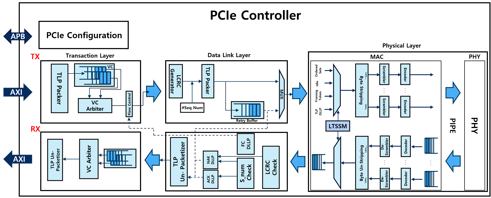

# PCIe Controller with UVM

## Author

- `Junseung Lee`
- junseung0728@naver.com

In this project, the implemented PCIe controller can be broadly divided into the transmitter (Tx) and the receiver (Rx). Both the transmitter and receiver are composed of the transaction layer, data link layer, and physical layer.

In the transmitter (Tx), a series of tasks are performed to send packets to the receiver (Rx). In the transaction layer, the tlp_header and tlp_data are packed and placed into one of the two FIFOs implemented as VCs. Then, through flow control, if there are enough credits in the receiver, the TLP is sent to the data link layer. In the data link layer, a sequence number and LCRC are generated and added to the front and back of the TLP. Additionally, to prepare for transmission errors, a copy of the generated TLP is stored in the retry buffer before the packet is sent to the physical layer. The TLP stored in the retry buffer is either removed or retransmitted depending on whether an ACK or NAK is received. In the physical layer, framing symbols are added to the front and back of the received TLP, and the final packet is sent to the receiver (Rx) through the PCIe link. During this process, the link state is controlled by the LTSSM state machine.

Conversely, in the receiver (Rx), a series of processes are carried out to unpack the received packet and check for packet errors through CRC verification.

(Note: For the sake of implementation convenience and to achieve the learning objectives, some logic does not fully adhere to PCIe specifications.)

Korean) 본 프로젝트에서 구현된 PCIe 컨트롤러는 크게 송신단(Tx)과 수신단(Rx)으로 나눌 수 있습니다. 송신단과 수신단은 각각 transaction layer, data link layer, physical layer로 구성되어 있습니다. 송신단(Tx)에서는 수신단(Rx)으로 packet을 보내기 위한 일련의 작업들이 수행됩니다. transaction layer에서는 tlp_header와 tlp_data를 packing하고, 두 개의 FIFO로 구현된 VC 중 하나로 들어갑니다. 이 후, flow control를 통해 수신단의 credit이 남아 있으면 TLP를 data link layer로 전송합니다. data link layer에서는 sequence number와 LCRC를 생성하여 TLP의 앞뒤에 추가합니다. 또한 송신 오류에 대비하기 위해 생성된 TLP의 복사본을 retry buffer에 저장한 뒤, physical layer로 packet을 전송합니다. Retry buffer 저장된 TLP는 ACK 또는 NAK에 따라 제거되거나 재전송됩니다. Physical layer에서는 입력받은 TLP의 앞뒤에 framing symbol을 추가하고, 만들어진 최종 packet을 PCIe 링크를 통해 수신단(Rx)으로 전송합니다. 이때 링크 상태를 제어하는 상태 머신인 LTSSM에 의해 제어됩니다. 반대로 수신단(Rx)에서는 전송받은 packet을 unpacking하고, CRC check를 통해 패킷의 오류 유무를 판별하는 일련의 과정을 거칩니다.

(참고: 구현의 편의성과 학습 목표 달성을 위해 일부 로직은 PCIe 사양을 완벽히 준수하지 않았습니다.)

  

  

