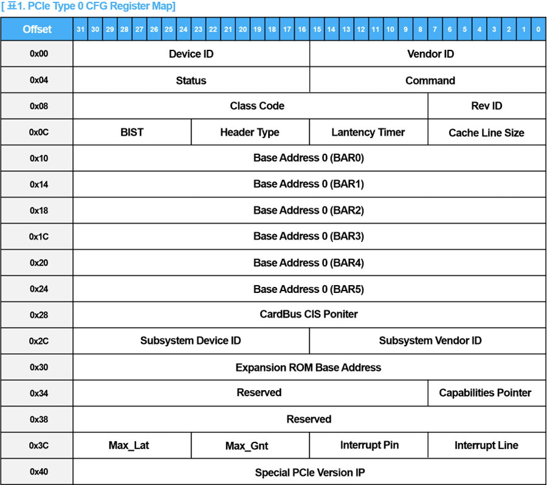

# PCIe_CFG Module

The `PCIe_CFG` module is a PCIe configuration register block implemented using Verilog. This module interfaces with an AMBA APB (Advanced Microcontroller Bus Architecture - Advanced Peripheral Bus) and manages the configuration registers for a PCIe device. Below is a detailed explanation of the module components and functionality.

## Module Interface

### Inputs

- **clk**: Clock signal.
- **rst_n**: Active-low reset signal.
- **psel_i**: APB select signal.
- **penable_i**: APB enable signal.
- **paddr_i**: APB address signal (12-bit).
- **pwrite_i**: APB write signal.
- **pwdata_i**: APB write data signal (32-bit).

### Outputs

- **pready_o**: APB ready signal.
- **prdata_o**: APB read data signal (32-bit).
- **pslverr_o**: APB slave error signal.

## Configuration Registers

The module contains several configuration registers, each representing specific PCIe configuration parameters. These registers include:

- `vendor_id`, `device_id`
- `status`, `command`
- `class_code`, `rev_id`
- `bist`, `header_type`
- `latency_timer`, `cache_line_size`
- `bar` (Base Address Registers)
- `cardbus_cis`
- `subsystem_vendor_id`, `subsystem_device_id`
- `exp_rom_base`
- `capabilities_pointer`
- `reserved_0`, `reserved_1`
- `max_lat`, `max_gnt`, `int_pin`, `int_line`
- `special_pcie_ip`

## Write Operation

A write operation occurs when all the following conditions are met:

- The APB select signal is high.
- The APB enable signal is high.
- The APB write signal is high.

During a write operation, the module updates the corresponding registers based on the provided address and data. If the reset signal is active (low), all registers are reset to their default values.

## Read Operation

A read operation occurs when the following conditions are met:

- The APB select signal is high.
- The APB enable signal is low.
- The APB write signal is low.

During a read operation, the module retrieves data from the corresponding register based on the provided address. The read data is then output through the appropriate output signal.

## Output Assignments

The following signals are always driven:

- The APB ready signal is always set to high, indicating the module is always ready.
- The APB read data signal is driven by the retrieved read data.
- The APB slave error signal is always set to low, indicating no slave errors.

This module provides a straightforward implementation of a PCIe configuration space, supporting both read and write operations via the AMBA APB interface.
